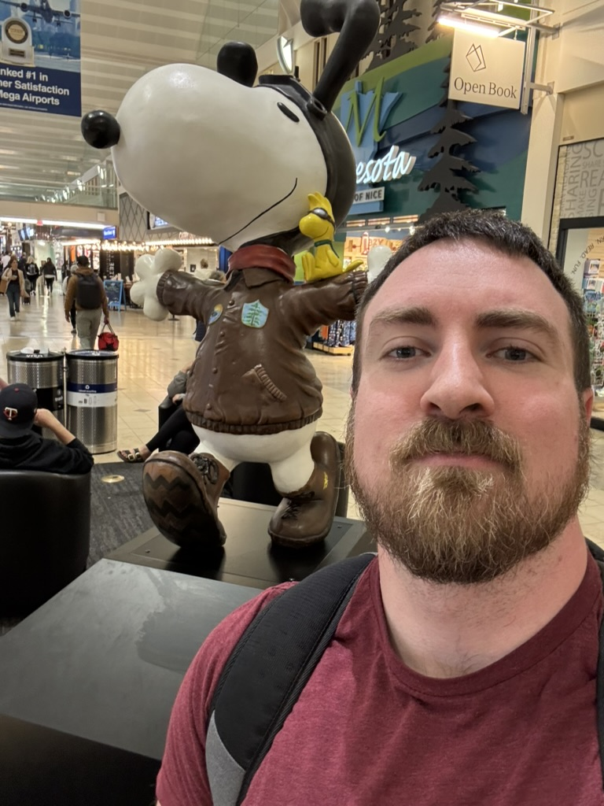
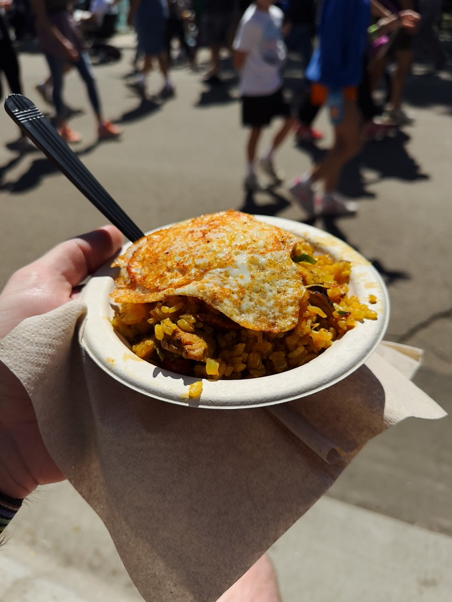
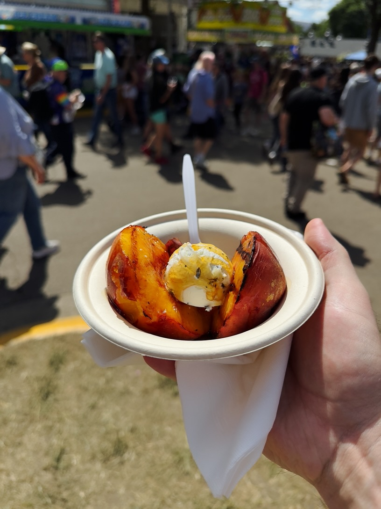
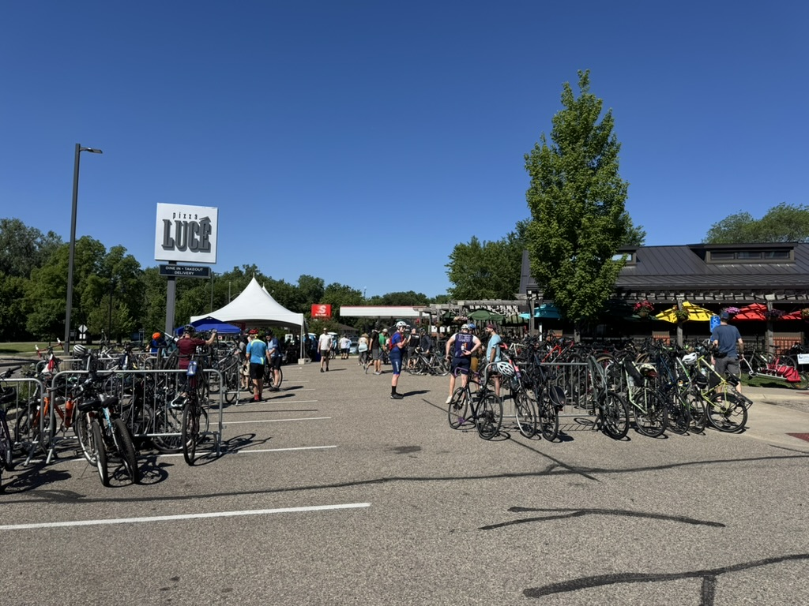
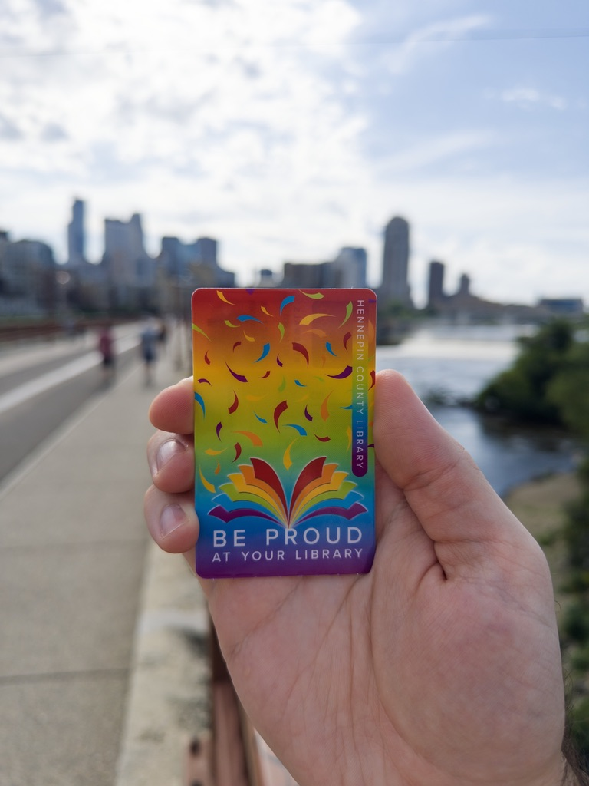
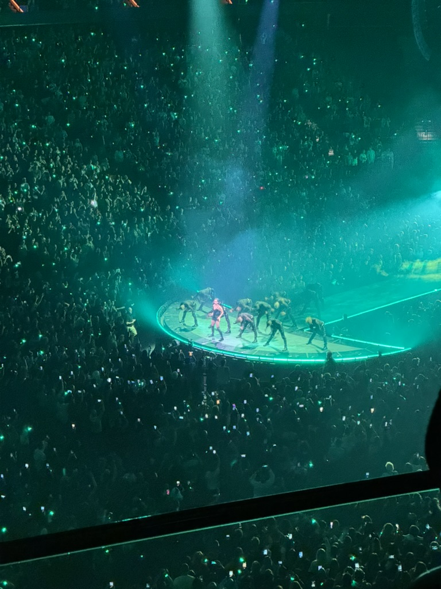
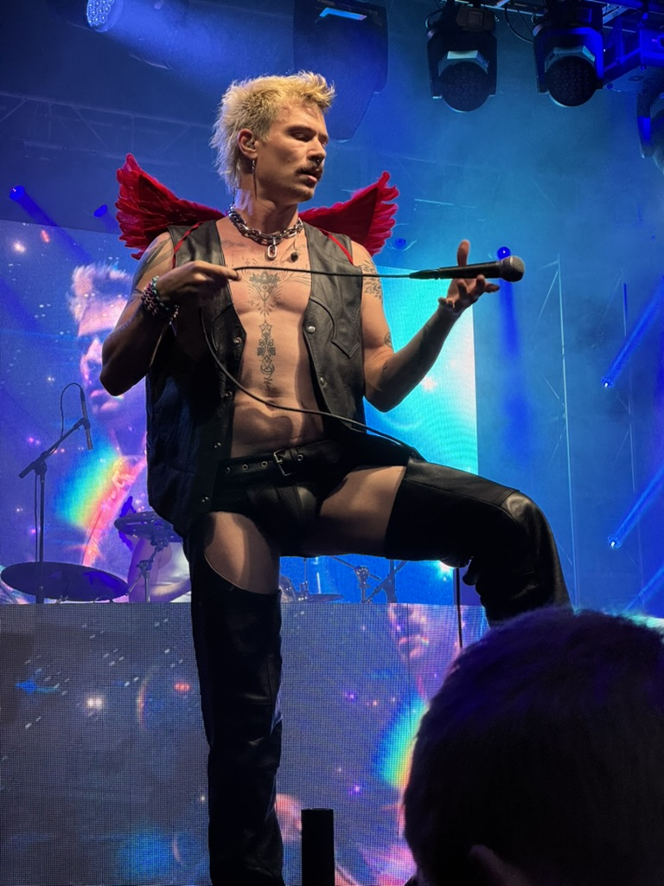

One year ago, I moved across the country for the second time in my life. I packed Jpeg and Kupo into my SUV and drove the 1,500 miles to my new home in Minneapolis (well, technically the suburb of St. Louis Park). Over the past year I've continually fallen in love with Minneapolis and Minnesota, so I wanted to share a list of twelve things that have brought me joy, in no particular order.

## 1. Micro Center

Back in Washington, your best bet for buying technology was Best Buy. If they didn't stock the thing you were looking for, your only option was to purchase it online. So this meant there were lots of simple things I had to have shipped, like PC case fans. Thankfully, I now live close to a Micro Center, which has an impressive stock of things like PC components, 3D printing supplies, hobby electronics, and more. I love being able to drive ten minutes down the road and buy things like a 10Gbps PCIe network adapter.

## 2. This statue of Snoopy at the Minneapolis-Saint Paul International Airport

## 3. Brito's Burrito

A local chain, Brito's is the best burrito I've ever had. It's just a short six-minute bike ride from my house, so I end up closing out the work week with a double chicken and queso burrito every Friday evening. My favorite part of Brito's (besides the affordability) is that they make their tortillas fresh; they press and cook the tortilla right as you order.

## 4. AMC Southdale 16

I moved from a city that didn't have a good AMC theater and now live in a metro with access to (arguably) the best AMC in the state: AMC Southdale 16. Since moving, I've subscribed to AMC's A-List subscription program which allows me to see up to four movies a week for a low subscription price. The Dolby Cinema at Southdale is a delight. I recently saw Christopher Nolan's _The Odyssey_ in Dolby Cinema, and short of a true 70MM IMAX experience, I think it's the best way to experience it.

## 5. The Minnesota State Fair

I could write at length about the Minnesota State Fair. I went on a beautiful 68-degree summer day and had some of the most incredible food I've ever had at a fair. [Paella Depot](https://www.paelladepot.com) was a particular standout, so much so that I went to a street festival the week after the fair to eat it again. Definitely going twice this year, as there were so many delicious options I didn't have the chance to try!

    
    

## 6. All the green

Moving from a desert climate to a humid continental climate, I love that trees are a part of my life again. Growing up in Louisiana, I'm used to being surrounded by trees and plants, so living where there were hardly any trees was a bit unnerving. I love that everything here is so verdant (sometimes a little too much so).

## 7. The feeling of an above-freezing day in the middle of winter

Even though it snowed in Central Washington, I've never experienced the level of cold that it gets in Minnesota. Overall, I didn't mind it, which was a relief. But there's something special about a long week of below-freezing temps so cold your nostrils freeze, and then suddenly being warm enough to go outside without a big winter coat.

## 8. The Tour de Lucé

Every year, the pizza chain Pizza Lucé holds an event called the Tour de Lucé, where participants bike between the locations throughout the Twin Cities. I had just purchased my first bike, so I wasn't quite ready for an 80-mile tour on a 90-degree day, but it was still great to spend a morning biking through the southwestern part of the metro. I loved seeing so many people doing the same.

## 9. Hennepin County Library cards

## 10. The iced vanilla latte I got from Duluth Coffee Company

During a trip up to Duluth, I got an iced vanilla latte from the flagship location of [Duluth Coffee Company](https://duluthcoffeecompany.com) that was the absolute perfect ratio of coffee to milk, and I think about it at least twice a week now.

## 11. Access to events

Since moving to the Twin Cities, I've had the chance to see [Atsuko Okatsuka](https://atsukocomedy.com), [Lucy Darling](https://www.carisahendrix.com), Lady Gaga, and [Zee Machine](https://www.instagram.com/zeemachine/?hl=en) (and am seeing Hilary Duff this weekend!). I love that I'm able to see nationally recognized artists without having to fly or board my dogs.

    
    

## 12. The rejection of fascism

This past winter, Minneapolis was thrust into the national spotlight for our defiance of the federal government's immigration enforcement activities. These efforts by Immigration and Customs Enforcement resulted in the murder of Renée Good and Alex Pretti, and the shooting of Julio Cesar Sosa-Celis. Throughout the city, you saw neighbors coming together to support one another and make it clear that ICE did not have the support of the people of Minneapolis. Nearly every small business in the metro now has a sign that essentially amounts to "Everyone is welcome here, except ICE".

And I'm damn proud to live in a city like that.
